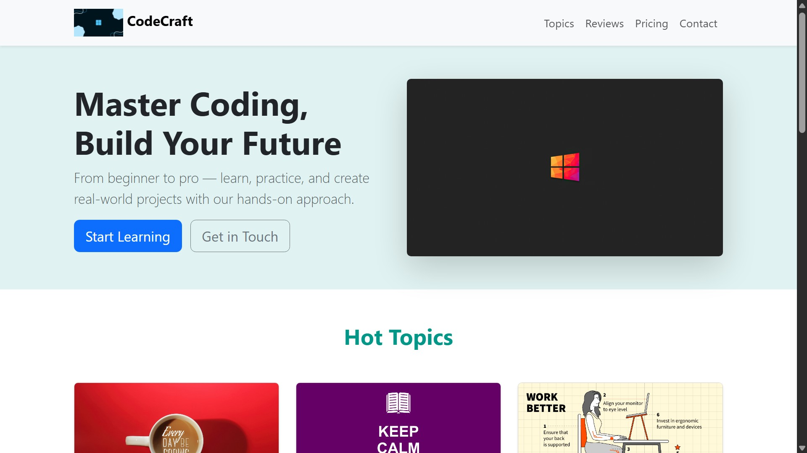

---

# CodeCraft Academy Website

A modern, responsive, and vibrant coding-themed landing page for **CodeCraft Academy** built using **Bootstrap 5**, custom CSS, and interactive UI components.  

This site is designed to promote coding education, showcase courses, display student testimonials, and provide a contact form — all with smooth navigation and dynamic features.

---

## ✨ Features

- **Bootstrap 5** responsive design for all devices.
- **Custom coding-themed color palette** (`Teal + Orange`).
- **Sticky Navbar** with scroll-spy highlighting.
- **Smooth Scroll** for in-page navigation.
- **Hero Section** with call-to-action buttons.
- **Hot Topics** section with hover animation on cards.
- **Testimonials Carousel** with improved visible controls.
- **Pricing Plans** with styled cards.
- **Contact Form** using Bootstrap's floating labels.
- **Back-to-Top Button** for quick navigation.
- **Favicon & Brand Logo** support.
- **Light Theme** with modern UI enhancements.

---

## 📂 Project Structure

```

CodeCraft-Academy/
│
├── assets/               # Images and icons
│   ├── 1.jpg              # Hero section image
│   ├── 2.jpg              # Web Dev topic
│   ├── 3.png              # AI & ML topic
│   ├── 4.jpg              # Cybersecurity topic
│   ├── 5.jpg              # Testimonial 1
│   ├── 6.jpg              # Testimonial 2
│   └── 7.png              # Logo & favicon
│
├── index.html             # Main HTML file
└── README.md              # Project documentation

````

---

## 🚀 Getting Started

### 1️⃣ Clone the repository
```bash
git clone https://github.com/your-username/CodeCraft-Academy.git
````

### 2️⃣ Open the project

Navigate to the project folder and open `index.html` in your browser:

```bash
cd CodeCraft-Academy
```

### 3️⃣ View the site

Double-click **index.html** or use a local server:

```bash
python -m http.server
```

Then visit: `http://localhost:8000`

---

## 🛠️ Technologies Used

* **HTML5** – Structure & layout
* **CSS3** – Custom styling
* **Bootstrap 5.3** – Responsive UI framework
* **Bootstrap Icons** – Iconography
* **JavaScript (Bootstrap Bundle)** – Carousel, navbar, and interactivity

---

## 🎨 Customization

You can easily update:

* **Colors**: Edit in the `:root` section of `<style>` in `index.html`.
* **Images**: Replace files inside `assets/` while keeping filenames consistent.
* **Content**: Modify text, pricing, or testimonials directly in the HTML.

---

## 📸 Preview



---

## 📜 License

This project is licensed under the **MIT License** — feel free to use and modify for your own projects.

---
